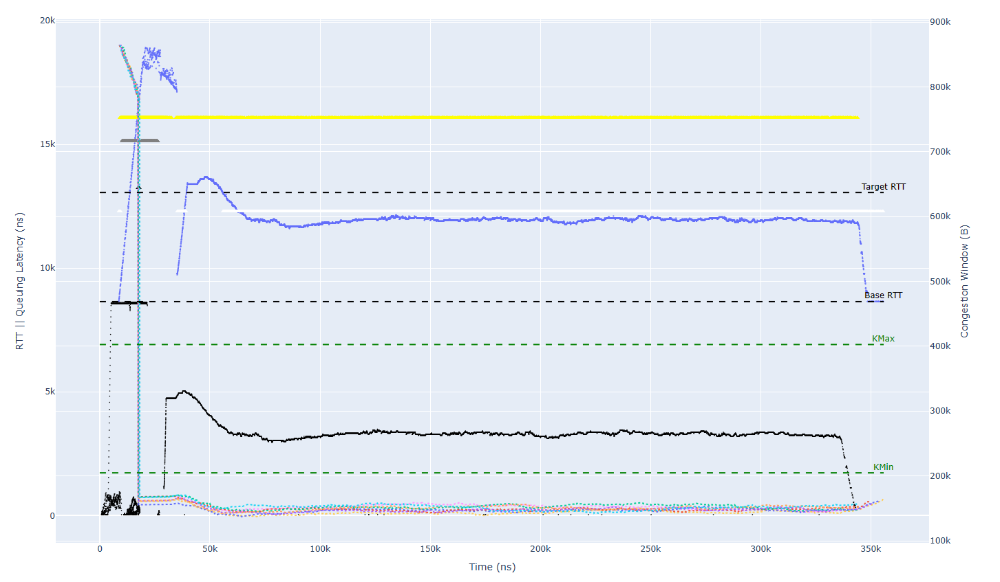

# htsim Network Simulator

htsim is a high performance discrete event simulator, inspired by ns2, but much faster, primarily intended to examine congestion control algorithm behaviour.  It was originally written by [Mark Handley](http://www0.cs.ucl.ac.uk/staff/M.Handley/) to allow [Damon Wishik](https://www.cl.cam.ac.uk/~djw1005/) to examine TCP stability issues when large numbers of flows are multiplexed.  It was extended by [Costin Raiciu](http://nets.cs.pub.ro/~costin/) to examine [Multipath TCP performance](http://nets.cs.pub.ro/~costin/files/mptcp-nsdi.pdf) during the MPTCP standardization process, and models of datacentre networks were added to [examine multipath transport](http://nets.cs.pub.ro/~costin/files/mptcp_dc_sigcomm.pdf) in a variety of datacentre topologies.  [NDP](http://nets.cs.pub.ro/~costin/files/ndp.pdf) was developed using htsim, and simple models of DCTCP, DCQCN were added for comparison.  Later htsim was adopted by Correct Networks (now part of Broadcom) to develop [EQDS](http://nets.cs.pub.ro/~costin/files/eqds.pdf), and switch models were improved to allow a variety of forwarding methods.  Support for a simple RoCE model, PFC, Swift and HPCC were added.

## The basics

There are some limited instructions in the [wiki](https://github.com/Broadcom/csg-htsim/wiki).  

htsim is written in C++, and has no dependencies.  It should compile and run with g++ or clang on MacOS or Linux.  To compile htsim, cd into the sim directory and run make.

To get started with running experiments, take a look in the experiments directory where there are some examples.  These examples generally require bash, python3 and gnuplot.

## Getting started with htsim

Compile with the following instruction. To do so, we recommend running the following command line from the ```/sim``` directory (feel free to change the number of jobs being run in parallel).

```
make clean && cd datacenter/ && make clean && cd .. && make -j 8 && cd datacenter/ && make -j 8 && cd ..
```

It is then possible to run htsim by using three possible methods:
- Using connection matrixes. Details [here](https://github.com/Broadcom/csg-htsim/wiki).
- Using C++ code to setup the simulation directly.
- Using LGS. See the following paragraphs for details.

## Main additions
We will explore here the main additions compared to the original htsim repository.
### SMaRTT
The SMaRTT congestion control protocol (see details on the paper here) has been added to htsim. It also includes a custom version to work on inter-DC topologies. The main files that have been changed/added to support this CC are:

- ```uec.cpp``` and ```uec.h``` --> here the main congestion control loop is described. 
- ```compositequeue.cpp``` and ```compositequeue.h``` --> the queue type that we use for the simulations. It supports trimming, phantom queues, Back-To-Sender and custom logging.
- ```main_uec.cpp``` and ```main_uec_entry_modern.cpp``` --> the two main entry points for the simulation. The first one is used with connection matrixes while the second one uses LGS. Future plans include merging these two and making the entry point a parameter. 

### BBR
The BBR congestion control protocol (see details on the paper [here](https://research.google/pubs/bbr-congestion-based-congestion-control-2/)) has been added to htsim. The main files that have been changed/added to support this CC are:
- ```bbr.cpp``` and ```bbr.h``` --> here the main congestion control loop is described. 
- ```main_bbr.cpp``` and ```main_bbr_entry_modern.cpp``` --> the two main entry points for the simulation. The first one is used with connection matrixes while the second one uses LGS.

### Custom Topology for Inter-DC traffic
Custom code has been added to support a toplogy where we have 2 FatTree DC linked together by border switches. It works by defining the number of border switches [1-4] and the oversubscription ratio.
In the future it could be easily updated to support 3 or more datacenter and not just 2.
The main files that have been changed/added to support this CC are:
- ```fat_tree_interdc_topology.cpp``` and ```fat_tree_interdc_topology.h``` --> here we define the topology.
- ```fat_tree_interdc_switch.cpp``` and ```fat_tree_interdc_switch.h``` --> here we define the custom routing for the topology.

### Dragonfly Topology
In the dragonfly topology every switch is connected to a fixed number of endpoints (denoted by the input parameter p). Each switch is in a group of switches in which every pair of switches is connected through a direct link. Every group has the same size (denoted by the input parameter a). Every two groups are connected by one global link connected to each a switch in the groups. The number of global links per switch is denoted by the input parameter h. Therefore, there are h+1 groups with each a switches and p nodes per switch. The router radix of this topology is h+(a-1)+p.

### Slimfly Topology

### Hammingmesh Topology

## Basic Instructions

We currently provide two entry points to run the simulator with the support of LogGOPSim: htsim_uec_entry_modern and htsim_ndp_entry_modern. The idea here is that these entry points will execute the GOAL input file (in binary format) that is given as part of the ```-goal``` command. The input file should be inside ```sim/lgs/input/```.
We include two sample input files (```incast_1024_100_4194304.bin``` and ```incast_1024_8_4194304.bin```).

To actually run the application a typical command line would look like this (from inside the /datacenter folder and for SMaRTT protocol):
```
./htsim_uec_entry_modern -o uec_entry -k 1 -algorithm smartt -nodes 16 -q 4452000 -strat ecmp_host_random2_ecn -number_entropies 1024 -kmin 2 -kmax 80 -use_fast_increase 0 -use_super_fast_increase 1 -fast_drop 1 -linkspeed 100000 -mtu 4096 -seed 15 -queue_type composite -hop_latency 700 -switch_latency 0 -reuse_entropy 1 -goal one_send.bin -x_gain 0.25 -y_gain 2 -w_gain 2 -z_gain 0.8 -bonus_drop 1.5 -collect_data 0 -use_pacing 0 -decrease_on_nack 1 -topology normal -max_queue_size 1000000 > out2.tmp
```

We can also run the same example using connection matrices by doing
```
./htsim_uec_entry_modern -o uec_entry -k 1 -algorithm smartt -nodes 16 -q 4452000 -strat ecmp_host_random2_ecn -number_entropies 1024 -kmin 2 -kmax 80 -use_fast_increase 0 -use_super_fast_increase 1 -fast_drop 1 -linkspeed 100000 -mtu 4096 -seed 15 -queue_type composite -hop_latency 700 -switch_latency 0 -reuse_entropy 1 -tm connection_matrices/one_send -x_gain 0.25 -y_gain 2 -w_gain 2 -z_gain 0.8 -bonus_drop 1.5 -collect_data 0 -use_pacing 0 -decrease_on_nack 1 -topology normal -max_queue_size 1000000 > out2.tmp
```

## Generating GOAL input files
We will now explain how to generate a goal inpute file and then how to convert it into a binary format for it to be used as input.

### Manually
It is possible to write a goal input file manually. For the specific of it, please check the original [GOAL](https://htor.inf.ethz.ch/publications/img/hoefler-goal.pdf) paper and [LGS](https://htor.inf.ethz.ch/publications/img/hoefler-loggopsim.pdf) paper.

### Schedgen
Schedgen offers a quick system to generate traces based on a specific traffic format. We currently support a numbers of MPI collectives and also general traffic patters such as incast, permutation, tornado... Check the ```utilities/schedgen/schedgen.cpp``` file for more infromation.
As as example, to generate a permutation with multiple send/recv per node, we would use (after running ```make```):

```
./schedgen -p multiple_permutation -s 64 -o mp.goal -d 1000000
```
This will generate a ```.goal``` input file for 64 nodes and a message of 1MiB.

### Convert GOAL raw files to binary
Finally, to convert the GOAL input files to binary we need to use the built in tool. The usage is very simple and follows the following command line from ```utilities/goal_converter/``` (after running ```make``` from the same folder):
```
./txt2bin -i ./mp.goal -o ./mp.bin -p
```
This will generate a binary file that we can then use as input file for htsim when specifying the ```-goal``` parameter.

## Plotting

We currently provide several plotting files but the main is:

- ```performance_complete.py``` will generate a plot with some overall results including RTT, CWND, NACK, ECN, Queue sizes over time.

Please check the files for more command line options that can be used with both. It is also possible that some Python libraries will need to be installed.

## Example

If we want to run a 8:1 incast with SMaRTT with 4MiB messages on a normal FatTree topology, we would do the following steps:

- First run the program by using the following command (please note we are using default parameters of SMaRTT for the run) 
```
../sim/datacenter/htsim_uec_entry_modern -o uec_entry -k 1 -algorithm delayB -nodes 1024 -q 4452000 -strat ecmp_host_random2_ecn -number_entropies 256 -kmin 20 -kmax 80 -target_rtt_percentage_over_base 50 -use_fast_increase 1 -use_super_fast_increase 1 -fast_drop 1 -linkspeed 800000 -mtu 4096 -seed 919 -queue_type composite  -hop_latency 700 -reuse_entropy 1 -goal incast_1024_8_4194304.bin -x_gain 2 -y_gain 2.5 -w_gain 2 -z_gain 0.8  -collect_data 1 > out.tmp
```

- Run the plotting by using ```performance_complete.py```

- A broswer should open showing the following plot:


On the other hand, we can run the inter datacenter version of SMaRTT by running
```
./htsim_uec_entry_modern -o uec_entry -k 1 -algorithm intersmartt_advanced -nodes 16 -q 4452000 -strat ecmp_host_random2_ecn -number_entropies 1024 -kmin 2 -kmax 80 -use_fast_increase 1 -use_super_fast_increase 1 -fast_drop 1 -linkspeed 80000 -mtu 4096 -seed 15 -queue_type composite -hop_latency 700 -switch_latency 0 -reuse_entropy 1 -goal one_send_interdc2.bin -x_gain 5 -y_gain 0 -w_gain 0 -z_gain 2.5 -bonus_drop 1.0 -collect_data 1 -explicit_starting_cwnd 5600000 -explicit_starting_buffer 560000 -use_pacing 1 -use_phantom 1 -phantom_slowdown 5 -phantom_size 5600000 -decrease_on_nack 0 -topology interdc > out3.tmp
```

## Main Paramters Explanation for SMaRTT
Here we have a summary of the most important parameters for SMaRTT when running the previous two examples:
- ```-algorithm``` indicated the CC algorithm. We are currently using ```smartt``` for default SMaRTT and ```intersmartt``` for the interDC version of SMarTT.
- ```-topology``` indicates whether we are using a normal Fat Tree topology (```normal```) or a interDC one (```interdc```).
- ```-nodes``` indicates the number of nodes in the topology. If we are using the interDC one then it will be doubled in total.
-```-strat``` indicates the routing being used. ```ecmp_host_random2_ecn``` is REPS. This will be updated eventually.
- ```-number_entropies``` indicates the number of entropies.
- ```-kmin``` and ```-kmax``` indicates the kmin and kmax as a percentage of the queue size.
- ```-use_fast_increase``` indicates whether FastIncrease is active.
- ```-fast_drop``` indicates whether QuickAdapt is on.
- ```-linkspeed``` indicates the link speed in Mbps.
- ```-mtu``` indicates the MTU in Bytes.
- ```-seed``` sets a seed for the simulation.
- ```-queue_type``` indicates the queue to use. In our simulations we always use ```composite```.
- ```-hop_latency``` indicates the link latency in ns.
- ```-switch_latency``` indicates the switch latency in ns.
- ```-goal``` indicates the goal file to use.
- ```-collect_data``` collect custom data for plotting.

General Purpose SMaRTT:
- ```-decrease_on_nack``` indicates how much in % of a MTU we want to decrease when receiving a NACK.
- ```-x_gain``` indicates how much we want to increase when doing fair increase per RTT in packets.
- ```-y_gain``` indicates how much we want to increase when doing multiplicative increase.
- ```-w_gain``` indicates how much we want to decrease when doing multiplicative decrease.
- ```-z_gain``` indicates how much we want to decrease when doing fair decrease.

Specific to InterDC SMaRTT:
- ```-use_pacing``` enables pacing.
- ```-phantom_slowdown``` indicates how much the phantom queue dequeues slower compared to the real queue.
- ```-phantom_size``` indicates the phantom queue size.